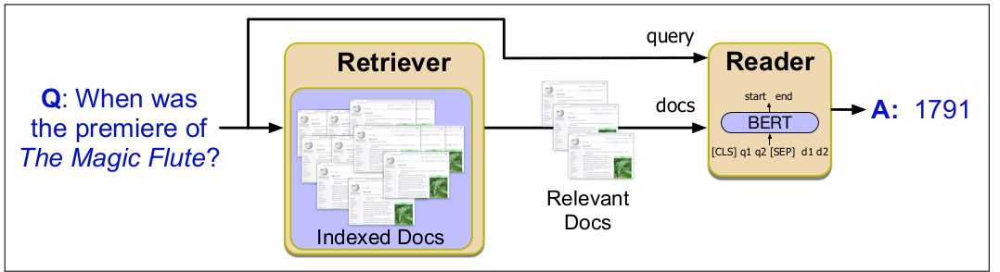

# Open Domain Question Answering System with Multi Span Answering Ability

A question-answering system based on information retrieval that answers questions from the
NCERT textbook. BERT was implemented as the reader model, with the added feature of responding questions
with multiple lines of answer. To match and retrieve relevant context passages, the Information Retrieval component employs the BM25 okapi method.

## Collaborators
Karthik Hegde, Jishnu V Kumar, Saravan Sriram

